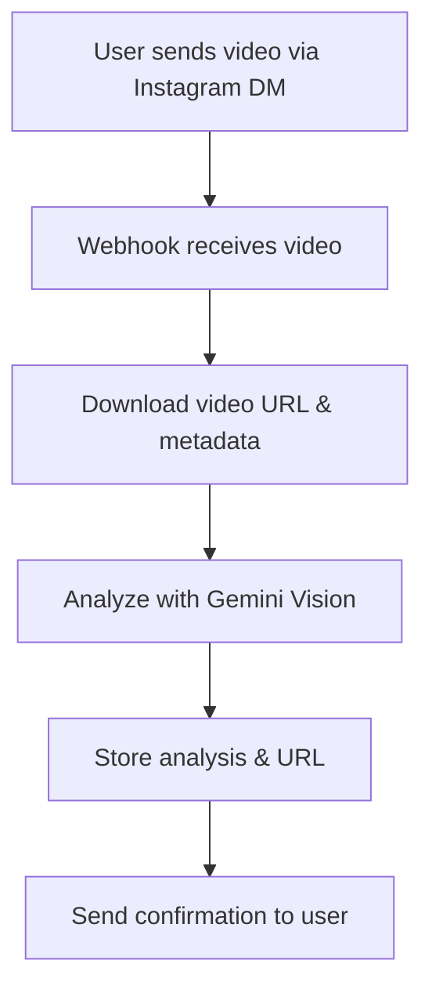
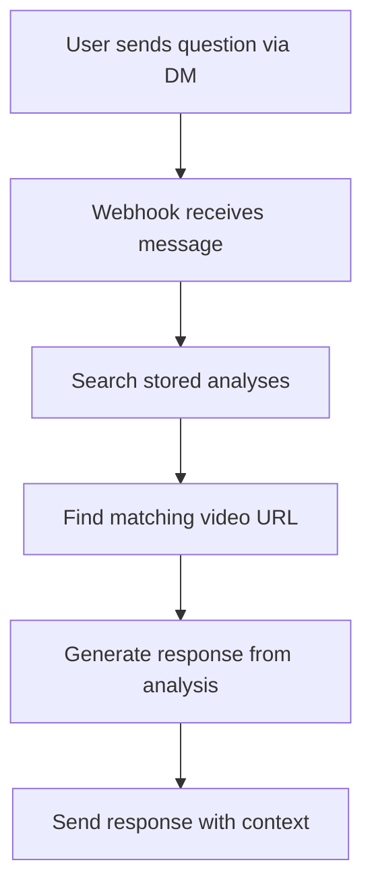

# Reel Memory AI Architecture

## Overview
Reel Memory AI helps users recall information from Instagram videos they've shared. When a user shares a video, the system uses Gemini to analyze its content and stores this analysis along with the video URL. Later, when the user asks questions, the system finds the relevant video URL and content to provide accurate responses.

## Core Goals
1. **Video Analysis**: Use Gemini to understand and extract content from shared videos
2. **Content & URL Mapping**: Store video analysis with corresponding URLs for future reference
3. **Query Understanding**: Match user questions to relevant stored videos
4. **Accurate Responses**: Provide relevant information and video URLs in responses

## System Architecture

### 1. Video Processing Flow


#### Key Components:
- **Webhook Handler**: Receives Instagram video URLs and metadata
- **Gemini Processor**: Analyzes video content using Gemini Vision API
- **Storage System**: 
  - Stores video analysis text
  - Maps analysis to video URLs
  - Organizes by user namespace

### 2. Query Processing Flow


#### Key Components:
- **Message Handler**: Processes user questions
- **Search System**: 
  1. Finds relevant video analysis
  2. Retrieves associated video URL
  3. Generates contextual response
- **Response Handler**: Formats and sends response with video reference

## Implementation Details

### 1. Video Analysis
- **Gemini Vision API**: Process video content and generate detailed description
- **Analysis Storage**: Store complete analysis with video metadata
- **URL Mapping**: Maintain relationship between analysis and source video

### 2. Data Organization
```
User Namespace
└── Videos
    ├── Video Entry 1
    │   ├── URL
    │   ├── Gemini Analysis
    │   ├── Metadata
    │   │   ├── Timestamp
    │   │   ├── Video ID
    │   │   └── User Info
    │   └── Embeddings
    └── Video Entry 2
        ├── ...
```

## API Endpoints

### 1. Video Processing
```typescript
POST /api/incoming/video
{
  userNS: string;      // User namespace
  videoUrl: string;    // Instagram video URL
  MediaType: string;   // Content type
  InstaId: string;     // Instagram ID
  username: string;    // User's username
  name: string;        // User's name
}

Response:
{
  success: boolean;
  analysis: string;    // Gemini's video analysis
  videoUrl: string;    // Stored video URL
}
```

### 2. Message Processing
```typescript
POST /api/incoming/message
{
  userNS: string;      // User namespace
  InstaMsgTxt: string; // User's question
  MediaType: string;   // Message type
  InstaId: string;     // Instagram ID
  username: string;    // User's username
  name: string;        // User's name
}

Response:
{
  success: boolean;
  answer: string;      // Response to user's question
  videoUrl: string;    // Reference to relevant video
  context: string;     // Relevant portion of video analysis
}
```

## Testing Strategy

### 1. End-to-End Tests
- Video analysis accuracy
- URL storage and retrieval
- Query-video matching
- Response relevance

### 2. Component Tests
- Gemini API integration
- Storage system validation
- Search accuracy
- Response formatting

## Performance Considerations

### 1. Video Analysis
- Optimize Gemini API calls
- Efficient video URL handling
- Analysis storage optimization

### 2. Query Processing
- Fast search capabilities
- Quick URL retrieval
- Efficient response generation

## Security Considerations

### 1. Data Privacy
- Secure video URL storage
- User data protection
- Analysis content security

### 2. API Security
- Webhook validation
- Access control
- Rate limiting

## Future Enhancements

1. **Analysis Quality**
   - Enhanced video understanding
   - Better content extraction
   - Multi-video context

2. **User Experience**
   - Improved response accuracy
   - Better video referencing
   - Enhanced context retrieval

3. **System Optimization**
   - Faster analysis
   - Better storage efficiency
   - Improved search speed 